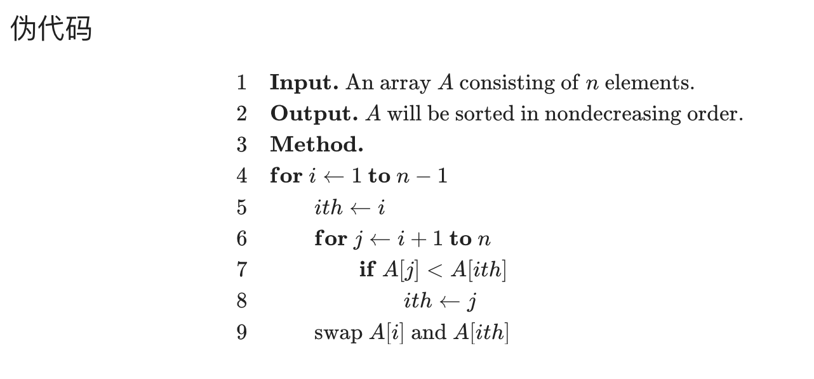
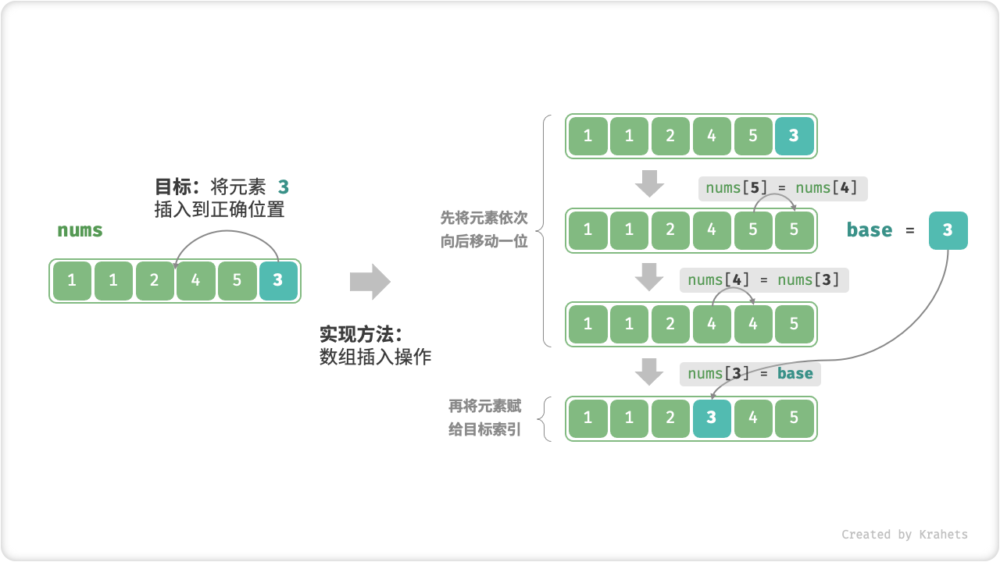
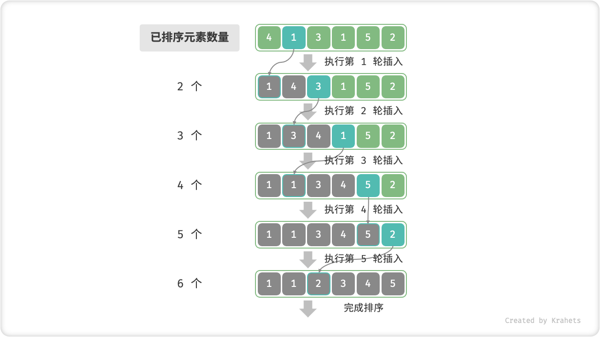

<!-- TOC -->
* [基础排序算法](#基础排序算法)
    * [选择排序](#选择排序)
        * [相关阅读](#相关阅读)
    * [插入排序](#插入排序)
        * [基本思想](#基本思想)
        * [特点](#特点)
        * [优化](#优化)
            * [插入排序的哨兵「Sentinel」模式](#插入排序的哨兵sentinel模式)
            * [二分插入排序/折半插入排序](#二分插入排序折半插入排序)
    * [希尔排序](#希尔排序)
        * [基础简单实现](#基础简单实现)
            * [Hibbard序列（时间复杂度$O(n^{3/2})$）](#hibbard序列时间复杂度on32)
            * [Knuth序列（$O(n^{5/4})$）](#knuth序列on54)
            * [Sedgewick序列（平均$O(n^{4/3})$）](#sedgewick序列平均on43)
            * [Ciura最优序列（经验优化序列）](#ciura最优序列经验优化序列)
<!-- TOC -->

# 基础排序算法

排序算法包括如「选择排序」「冒泡排序」「插入排序」（插入排序可以作为高级排序的子过程，是一个需要重点学习的排序算法）
「希尔排序」（希尔排序是插入排序的优化）「归并排序」（理解递归，也是重点学习的排序算法）「快速排序」(
同样是理解递归，重点学习的排序算法)
「堆排序」（选择排序的优化，也是重点学习的排序算法）

除此之外还有非比较排序，包括「计数排序」「基数排序」「桶排序」

> 虽然现在计算机编程语言基本都带了排序的库，但学习理解经典的排序的算法可以帮助我们更好的理解算法的思想，以及如何优化算法。

在基础排序算法中，我们可以学到的算法思想包括「分治」「贪心」「假设修正法」「打擂台」「哨兵」「双指针」「循环不变量」

在排序算法的学习中，也能进一步对时间复杂度的理解

这里有个关于数组的知识点，数组在内存中是连续存储的，我们可以通过下标直接访问，我们可以以O(1)的时间复杂度访问到元素，而这个特性叫作
*随机访问*

## 选择排序

基本思想：从小到大依次选择出最小元素，通过交换达到选择排序的目的

特点：运行时间与输入无关，交换次数最少

思想：减而治之，贪心算法

技巧：假设修正法（打擂台算法）

循环不变式：证明贪心算法的依据

优化：堆排序

*参考案例*

```java
public class Solution {

    // 「力扣」第 912 题：排序数组

    public int[] sortArray(int[] nums) {
        int len = nums.length;
        // 最后一轮只有一个元素，一定是最大的元素，因此写 i < len - 1
        for (int i = 0; i < len - 1; i++) {
            // 在 [i + 1, len - 1] 区间里选择最小的元素的下标
            int minIndex = i;
            for (int j = i + 1; j < len; j++) {
                if (nums[j] < nums[minIndex]) {
                    minIndex = j;
                }
            }
            swap(nums, minIndex, i);
        }
        return nums;
    }

    private void swap(int[] nums, int index1, int index2) {
        int temp = nums[index1];
        nums[index1] = nums[index2];
        nums[index2] = temp;
    }
}
```

时间复杂度：O(n^2) 等差数列公式得出 (N−1)+(N−2)+⋯+1 = 1/2N(N-1) -> 1/2N(N-1) + (N-1) -> O(N^2)

$$\displaystyle \sum _{i=1}^{n-1}i={\frac {(n-1)+1}{2}}(n-1)={\frac {1}{2}}n(n-1)={\frac {1}{2}}(n^{2}-n)$$

空间复杂度：O(1) 原地排序

[https://oi-wiki.org/basic/selection-sort/](https://oi-wiki.org/basic/selection-sort/)




```java
class Solution {
    public int[] sortArray(int[] nums) {
        for (int i = 0; i < nums.length - 1; i++) {
            int minIndex = i;
            for (int j = i + 1; j < nums.length; j++) {
                if (nums[j] < nums[minIndex]) {
                    minIndex = j;
                }
            }
            swap(nums, minIndex, i);
        }
        return nums;
    }

    private void swap(int[] nums, int minIndex, int i) {
        int temp = nums[minIndex];
        nums[minIndex] = nums[i];
        nums[i] = temp;
    }
}
```

* [「力扣」1. 两数之和 （暴力求解）](https://leetcode.cn/problems/two-sum)

[TwoSum.java](../src/sort/leetcode/select/TwoSum.java)

```java
package sort.leetcode;

/**
 * <a href="https://leetcode.cn/problems/two-sum">
 * 1. 两数之和 (选择排序思维，暴力求解)
 * </a>
 *
 * @author AhogeK ahogek@gmail.com
 * @since 2023-06-28 11:21:09
 */
public class TwoSum {

    public int[] twoSum(int[] nums, int target) {
        int n = nums.length;
        for (int i = 0; i < n - 1; i++) {
            for (int j = i + 1; j < n; j++) {
                if ((nums[i] + nums[j]) == target) return new int[]{i, j};
            }
        }
        return new int[]{};
    }
}
```

* [「力扣」11. 盛最多水的容器](https://leetcode.cn/problems/container-with-most-water)

[ContainerWithMostWater.java](../src/sort/leetcode/select/ContainerWithMostWater.java)

```java
package sort.leetcode.select;

/**
 * <a href="https://leetcode.cn/problems/container-with-most-water">
 * 11. 盛最多水的容器 (双指针)
 * </a>
 *
 * @author AhogeK ahogek@gmail.com
 * @since 2023-06-28 14:27:53
 */
public class ContainerWithMostWater {

    public int maxArea(int[] height) {
        int left = 0;
        int right = height.length - 1;
        int ans = Integer.MIN_VALUE;
        while (left < right) {
            int area = Math.min(height[left], height[right]) * (right - left);
            ans = Math.max(ans, area);
            if (height[left] < height[right]) left++;
            else right--;
        }
        return ans;
    }
}
```

* [使用冒泡排序完成「力扣」第 912 题：排序数组](https://leetcode-cn.com/problems/sort-an-array/)

[BubbleSort.java](../src/sort/leetcode/select/BubbleSort.java)

```java
package sort.leetcode.select;

/**
 * 使用冒泡排序完成 「力扣」912. 排序数组
 *
 * @author AhogeK ahogek@gmail.com
 * @since 2023-06-29 20:55:40
 */
public class BubbleSort {

    public int[] sortArray(int[] nums) {
        int size = nums.length;

        for (int i = 0; i < size - 1; i++) {
            boolean swapped = false;
            for (int j = 0; j < size - i - 1; j++) {
                if (nums[j] > nums[j + 1]) {
                    int temp = nums[j + 1];
                    nums[j + 1] = nums[j];
                    nums[j] = temp;
                    swapped = true;
                }
            }
            if (!swapped)
                break;
        }

        return nums;
    }
}
```

**上面的冒泡排序使用了优化，如果已经排序好了会提前终止算法**

### 相关阅读

* [Selection Sort Algorithm](https://www.programiz.com/dsa/selection-sort)
* [Selection sort Wiki](https://en.wikipedia.org/wiki/Selection_sort)
* [Bubble Sort](https://www.programiz.com/dsa/bubble-sort)
* [Bubble sort Wiki](https://en.wikipedia.org/wiki/Bubble_sort)

## 插入排序

### 基本思想

插入排序是通过有序序列，对于未排序数据，在已排序序列中从后向前扫描，找到相应位置并插入。「减而治之」思想。

### 特点

* 内循环可以提前终止
* 原始数组越接近有序，插入排序的时间性能越好
* 小规模数组（构成逆序的对数少）可以视为近乎有序

### 优化

* 暂存，逐个向后赋值
* 哨兵
    * 回避边界条件的判断
    * 减少分类讨论的分支
    * 「单链表」中 「哨兵」的使用很常见
* 希尔排序


[Insertion Sort – Data Structure and Algorithm Tutorials](https://www.geeksforgeeks.org/insertion-sort/)




[插入排序 - Hello 算法](https://www.hello-algo.com/chapter_sorting/insertion_sort/)

```java
class Solution {
    public int[] sortArray(int[] nums) {
        for (int i = 1; i < nums.length; i++) {
            int j = i;
            while (j > 0 && nums[j - 1] > nums[j]) {
                swap(nums, j - 1, j);
                j--;
            }
        }
        return nums;
    }

    private void swap(int[] nums, int i, int j) {
        int temp = nums[i];
        nums[i] = nums[j];
        nums[j] = temp;
    }
}
```

*逐个向后赋值的写法*

```java
public class Solution {
    public int[] sortArray(int[] nums) {
        int len = nums.length;
        // 循环不变量：将 nums[i] 插入到区间 [0, i) 使之有序
        for (int i = 1; i < len; i++) {
            // 先暂存这个元素，然后之前数值严格小于 temp 的所有元素逐个后移
            int temp = nums[i];
            int j = i;
            // 注意边界 j > 0
            while (j > 0 && nums[j - 1] > temp) {
                nums[j] = nums[j - 1];
                j--;
            }

            // 最后这一步容易忽略
            nums[j] = temp;
        }
        return nums;
    }
}
```

**插入排序内层循环可以提前终止，这一点是插入排序非常重要的性质。相比于前一种，该模式不会超时。**

#### 插入排序的哨兵「Sentinel」模式

*它能帮助我们：1、回避边界条件；2、减少分类讨论。*

```java
class Solution {
    public int[] sortArray(int[] nums) {
        if (nums.length == 1) {
            return nums;
        }

        int minIndex = 0;
        for (int i = 0; i < nums.length; i++) {
            if (nums[i] < nums[minIndex]) {
                minIndex = i;
            }
        }
        if (minIndex != 0)
            swap(nums, 0, minIndex);

        for (int i = 2; i < nums.length; i++) {
            int j = i;
            int temp = nums[j];
            while (j > 1 && nums[j - 1] > temp) {
                nums[j] = nums[j - 1];
                j--;
            }
            nums[j] = temp;
        }

        return nums;
    }

    private void swap(int[] nums, int a, int b) {
        int temp = nums[a];
        nums[a] = nums[b];
        nums[b] = temp;
    }
}
```

#### [二分插入排序/折半插入排序](../src/sort/InsertionSort.java)

```java
class Solution {
    public int[] sortArray(int[] nums) {
        for (int i = 1; i < nums.length; i++) {
            int temp = nums[i];
            // 使用二分查找查找插入的位置
            int j = Math.abs(Arrays.binarySearch(nums, 0, i, temp) + 1);
            // 将数组向右移动一个位置
            System.arraycopy(nums, j, nums, j + 1, i - j);
            // 将元素放置在其正确的位置上
            nums[j] = temp;
        }
        return nums;
    }
}
```

```
arr = [3, 1, 4, 2]
i = 1
arr[i] = 1
so pos = 0
so System.arraycopy will [3, 3, 4, 2]
then arr[pos] = arr[i] => [1, 3, 4, 2]
```

**逐个向后赋值的写法**

```java
class Solution {
    public int[] sortArray(int[] nums) {
        for (int i = 1; i < nums.length; i++) {
            int temp = nums[i];
            int j = i - 1;

            int loc = binarySearch(nums, temp, 0, j);

            while (j >= loc) {
                nums[j + 1] = nums[j];
                j--;
            }
            nums[j + 1] = temp;
        }
        return nums;
    }

    private int binarySearch(int[] nums, int target, int low, int high) {
        while (low <= high) {
            int mid = low + (high - low) / 2;
            if (target == nums[mid])
                return mid + 1;
            else if (target > nums[mid])
                low = mid + 1;
            else
                high = mid - 1;
        }

        return low;
    }
}
```

## [希尔排序](https://oi-wiki.org/basic/shell-sort/)

### [基础简单实现](../src/sort/ShellSort.java)

```java
public class ShellSort {

    public void sortArray(int[] nums) {
        // 边界处理
        if (nums.length <= 1) {
            return;
        }
        // 初始化间隔
        int gap = nums.length / 2;
        // 主循环
        while (gap > 0) {
            // 分组遍历
            for (int i = gap; i < nums.length; i++) {
                // 待比较的插入元素
                int temp = nums[i];
                // 当前下标，后续通过 [- gap] 操作位移比较
                int j = i;
                // 一直往前直到遇到比待插入大的
                while (j - gap >= 0 && nums[j - gap] > temp) {
                    nums[j] = nums[j - gap];
                    j -= gap;
                }
                nums[j] = temp;
            }
            // 每次循环间隔减半
            gap /= 2;
        }
    }
}
```

#### Hibbard序列（时间复杂度$O(n^{3/2})$）

数学表达式：
$$h_k = 2^k - 1 \quad (序列递减顺序)$$

```java
public void sortArray(int[] nums) {
    int k = (int) (Math.log(nums.length) / Math.log(2));
    while (k >= 1) {
        int gap = (int) (Math.pow(2, k) - 1);
        for (int i = gap; i < nums.length; i++) {
            int temp = nums[i];
            int j = i;
            while (j >= gap && nums[j - gap] > temp) {
                nums[j] = nums[j - gap];
                j -= gap;
            }
            nums[j] = temp;
        }
        k--;
    }
}
```

在Hibbard希尔排序中，这两行代码是生成递减间隔序列的核心：

1. `int k = (int) (Math.log(nums.length) / Math.log(2));`
    * 这是计算以2为底的数组长度的对数，取整数部分
    * 相当于求满足 $2^k \leq n$ 的最大整数k（其中n是数组长度）
    * 例如：当数组长度=100时，$k = \lfloor log_2(100) \rfloor = 6$，因为$2^6=64 \leq 100$

2. `int gap = (int) (Math.pow(2, k) - 1);`
    * 根据Hibbard提出的间隔序列公式生成gap值
    * 实际生成的是 $gap = 2^k - 1$ 的序列
    * 例如：当k=6时，gap=63；k=5时，gap=31，依此类推

示意图：

$$\begin{array}{ccc} \text{初始间隔序列} & \xrightarrow{\text{递减过程}} & \text{最终间隔} \\\ \underbrace{63,31,15,7,3,1} & \leftarrow \text{Hibbard序列} & \xrightarrow{\text{最后一次是插入排序}} \end{array}$$

#### Knuth序列（$O(n^{5/4})$）

数学表达式：
$$h_{k+1} = 3h_k +1 \quad (初始h_0=1)$$

```java
public void sortArray(int[] nums) {
    int gap = 1;
    while (gap < nums.length / 3) {
        gap = gap * 3 + 1; // 生成最大可用间隔
    }

    while (gap >= 1) {
        for (int i = gap; i < nums.length; i++) {
            int temp = nums[i];
            int j = i;
            while (j >= gap && nums[j - gap] > temp) {
                nums[j] = nums[j - gap];
                j -= gap;
            }
            nums[j] = temp;
        }
        gap = (gap - 1) / 3;
    }
}
```

#### Sedgewick序列（平均$O(n^{4/3})$）

递推公式：

$h_k = \begin{cases} 1 & k=0 \\\ 9(4^{k} - 2^{k}) +1 & k>0 \end{cases}$

```java
public void sortArray(int[] nums) {
    if (nums.length <= 1) return;

    Set<Integer> gapSet = new LinkedHashSet<>();
    int k = 0;

    while (true) {
        int t = (k % 2 == 0) ? k / 2 : (k + 1) / 2;
        int gap = (k % 2 == 0)
                ? 9 * (int) (Math.pow(4, t) - Math.pow(2, t)) + 1
                : (int) (Math.pow(4, t + 1) - 3 * Math.pow(2, t + 1)) + 1;

        // gap无效时立即退出
        if (gap > nums.length || gap <= 0) break;

        gapSet.add(gap);
        k++;
    }

    // 保障基础间隔（至少包含gap=1）
    gapSet.add(1);

    // 降序排列并执行排序
    List<Integer> gaps = new ArrayList<>(gapSet);
    gaps.sort(Collections.reverseOrder());
    for (int gap : gaps) {
        for (int i = gap; i < nums.length; i++) {
            int temp = nums[i];
            int j = i;
            while (j >= gap && nums[j - gap] > temp) {
                nums[j] = nums[j - gap];
                j -= gap;
            }
            nums[j] = temp;
        }
    }
}
```

Sedgewick提出的最优间隔序列公式为：

$$g_k = \begin{cases} 4^{k} + 3 \cdot 2^{k-1} + 1, & k \text{为奇数} \\\ 9 \cdot (4^{k} - 2^{k}) + 1, & k \text{为偶数} \end{cases}$$

#### Ciura最优序列（经验优化序列）

```java
public void sortArray(int[] nums) {
    int[] ciuraGaps = {701, 301, 132, 57, 23, 10, 4, 1};

    for (int gap : ciuraGaps) {
        if (gap > nums.length) continue;
        for (int i = gap; i < nums.length; i++) {
            int temp = nums[i];
            int j = i;
            while (j >= gap && nums[j - gap] > temp) {
                nums[j] = nums[j - gap];
                j -= gap;
            }
            nums[j] = temp;
        }
    }
}
```

经验公式：

$$\begin{aligned} \\h_{k+1} = \lfloor 2.25h_k \rfloor \\\ &\text{初始序列：[701, 301, 132, 57, 23, 10, 4, 1]} \end{aligned}$$


---

[返回](../README.md)